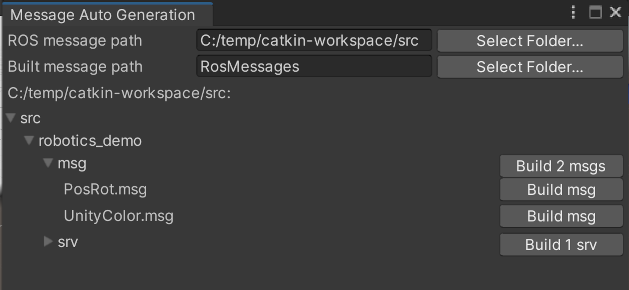

# Message Generation

To work with a ROS message in Unity, you first need to generate the corresponding C# message class. Select the menu option "RosMessageGeneration->Browse..." to open the message browser.

Select your ROS message folder at the top, then you can navigate through the folder structure to find the .msg files. Click the "Build msg" button to build the messages you want.

# Message importers

For a more automated workflow, you may find it useful to simply drag an entire ROS module folder into your Unity project. Unity will automatically find any .msg and .srv files in the folder structure, and convert them into C# message classes for you. And the classes will be updated if the .msg or .srv files change on disk.

NB: The message generation system looks for a ROS package.xml to determine what code to generate, so if you're working this way it's recommended to import an entire ROS module, rather than individual .msg files, into your Unity project.
