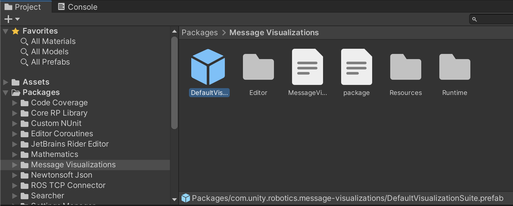
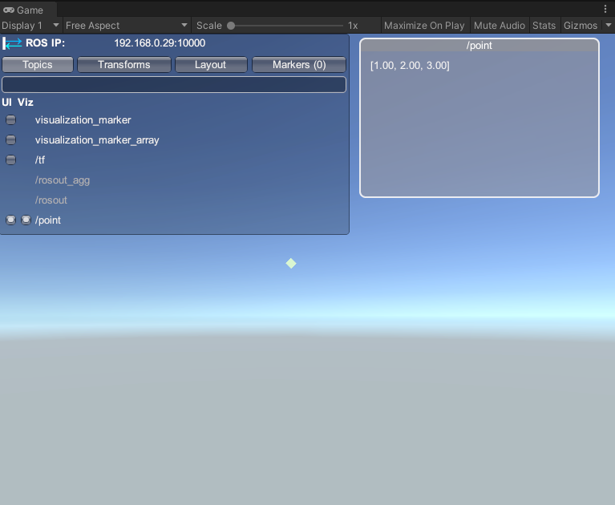
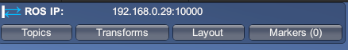

# Message Visualizations

The message visualizations package enables Unity projects to visualize incoming and outgoing information from ROS, such as sensor data, navigation messages, markers, and more. This package provides default configurations for common message types, as well as APIs to create custom visualizations.

**Table of Contents**
- [Getting Started](#getting-started)
- [Configuring a Visualization Suite](#configuring-a-visualization-suite)
- [The HUD](#the-hud)
- [Using the Inspector](#using-the-inspector)
  - [Message Topics](#message-topics)
  - [TF Topics and Tracking](#tf-topics-and-tracking)
  - [Visualization Settings](#visualization-settings)
  - [Pointclouds](#pointclouds)

---

## Getting Started

This package contains a `DefaultVisualizationSuite` prefab that provides visualizer components for many common ROS message types, organized in the hierarchy by package. These components control how messages are displayed in the Unity scene.

1. To begin, you will need to have ROS—Unity Integration set up in your project in order to send and receive ROS messages. If this is not yet set up, follow the steps [here](https://github.com/Unity-Technologies/Unity-Robotics-Hub/blob/main/tutorials/ros_unity_integration/README.md).
2. If you have not already added the Message Visualizations package in your Unity project, follow the [Installation steps](../../README.md#Installation) for the package.
3. Open the Unity scene that you would like add message visualizations to. In the Project window, expand `Packages/Message Visualizations`. Select the `DefaultVisualizationSuite` (indicated by the blue cube Prefab icon) and drag it into your scene Hierarchy.

    

4. Enter Play mode. The heads-up display (HUD) panel in the top left indicates a successful connection via the colored arrows in the top-left corner. If the HUD is not visible, ensure your connection throws no errors, and that `Show HUD` in the ROS Settings is on. More information about the HUD can be found [below](#the-hud).

    > If you encounter networking issues, please refer to the [Networking Guide](https://github.com/Unity-Technologies/Unity-Robotics-Hub/blob/main/tutorials/ros_unity_integration/network.md).

5. Once connected, you may begin sending and receiving ROS messages as usual. Topics will by default populate in the HUD panel's `Topics` list. For this example, run a simple publisher from your ROS workspace:
    ```
    rostopic pub /point geometry_msgs/Point 1 2 3
    ```

    Click the `Topics` tab in the HUD. You will see this sample topic, `/point` in the list. Click the topic name to toggle both the `UI` and `Viz` (alternatively, you can click each individual toggle).

    > The visualization is created based on the message type. You can also explicitly set a visualizer's topic in its [Inspector](#using-the-inspector).

6. You should now see a new window labeled with the topic in your Game view, populated with the `geometry_msgs/Point` data published. Additionally, the point is being drawn in the scene (you may need to adjust the Camera to see it in the Game view). You've now successfully set up visualizations!

    


## Configuring a Visualization Suite

The [Getting Started](#getting-started) steps describes the `DefaultVisualizationSuite` prefab that provides visualizer components for many common ROS message types. You may also create your own visualization suite by creating a GameObject with only the desired default or custom visualizer components for your project.

The UI windows for visualizations will automatically be laid out as they are turned on, but they can be dragged and resized. The visualizations in the scene can be customized as described in the [Inspector](#using-the-inspector) section. The topics being visualized and the window configurations are saved between sessions and can be exported and shared via the HUD's `Layout > Export/Import layout` buttons.

## The HUD



<!--  -->

The top-left panel provides a simple GUI system that offers tabs to toggle additional information about the state of the ROS communication and visualizations.

The default tabs on the HUD panel includes:

- **Topics**: Contains a list of all ROS topics on which this current session has sent or received a message. The `UI` toggle enables a window that shows the last message sent or received on that topic. The `Viz` toggle enables an in-scene drawing that represents the last message sent or received on that topic. If no `Viz` toggle is enabled, that topic does not have a default visualizer enabled in the Unity scene.
- **Transforms**: Contains [`tf`](http://wiki.ros.org/tf) visualization options, including displaying the axes, links, and labels for each frame.
- **Layout**: Contains options to save and load this visualization configuration. While the visualization components are by default saved via the scene or the prefab, the window layout and visualized message list is saved as a JSON file. By default, this file is saved to a `RosHudLayout.json` file on your machine's [`Application.persistentDataPath`](https://docs.unity3d.com/ScriptReference/Application-persistentDataPath.html) and loaded on each session. In this Layout tab, you can choose to `Export` this JSON file with a custom name to a chosen location on your device, as well as `Import` a layout JSON file to begin using that saved visualization configuration.
- **Markers**: TODO

The HUD is also designed to be customizable; you may add custom tabs or headers to the HUD. You can write a custom script similar to the [VisualizationLayoutTab](../Runtime/Scripts/VisualizationLayoutTab.cs) to extend the HUD. TODO

## Using the Inspector

The visualizers for each message type are implemented as Unity MonoBehaviours that are added as components to a GameObject in the scene. This is provided via the `DefaultVisualizationSuite` prefab, or as any custom visualization suite. In the `DefaultVisualizationSuite`, each individual default visualizer can be found by expanding the GameObject in the hierarchy and selecting the GameObject corresponding to the message type's package, e.g. `Geometry`.

### Message Topics

In the [Getting Started](#getting-started) example, the `/point` topic is subscribed to and visualized based on the ROS message type. You can also directly assign a topic in the visualizer component's Inspector--for this example, you can find this by expanding the `DefaultVisualizationSuite` GameObject in the Hierarchy and selecting the `Geometry` child. In the Inspector window, you will see all the default visualizers provided for this package.

The **Topic** field can be specifically assigned to customize visualizations for only that topic. This is particularly useful for adding multiple default visualizers of the same ROS message type, customized for different topics.


### TF Topics and Tracking

For messages with stamped headers, there is an option to customize the coordinate frame tracking per visualization. This is provided in the applicable default visualizers via the `TF Tracking Settings`, which contains options for a topic string and a type.

**TF Topic:** It is important to render 3D visualizations in the proper coordinate frame. By default, the `TF Topic` is assigned to `/tf`, but this can be replaced with a different or namespaced TF topic.

**Tracking Type - Exact:** This setting adds the visualization drawing as a child of the `BasicDrawingManager`. The drawing's transform will be modified directly based on the header contents.

**Tracking Type - Track Latest:** This setting places the visualization drawing in a GameObject corresponding to the proper `frame_id`. The drawing will have a zeroed local position and rotation, and the *frame* GameObject will be transformed appropriately.

**Tracking Type - None:** This setting will set the local position of the drawing to `Vector3.zero` and the local rotation to be `Quaternion.identity`.

### Visualization Settings

The 3D visualizations offer customization such as `label` and `color` fields, which will modify the drawing in the scene. Visualizations including lines or arrows (e.g. `sensor_msgs/Imu`) provide options for the length and thickness of the arrow as well as the radius around which any curved arrows are drawn.

> Note: Size-related fields are in Unity coordinates, where 1 unit = 1 meter.

### Point Clouds

Similar to the Visualization Settings, point cloud visualizations are highly customizable. Settings for these message visualizers (PointCloud, LaserScan, etc.) will be saved during runtime. For more information on this, you can check out the [base SettingsBasedVisualizer](../Runtime/Scripts/DrawingVisualizerWithSettings.cs) class, as well as read more about Unity's [ScriptableObjects](https://docs.unity3d.com/Manual/class-ScriptableObject.html).

The standard settings are provided in ScriptableObjects. Default settings are provided in the [`DefaultVisualizers/Sensor/ScriptableObjects/`](../Runtime/DefaultVisualizers/Sensor/ScriptableObjects/) directory, and can be created by right-clicking in the Project window under `Create > Robotics > Sensor`. After being created, this configuration can be dragged and dropped into the component's Inspector field `Visualizer settings,` or selected by clicking on the small circle to the right of the field.


The settings available will depend on the ROS message type.

**Channel Name**: These settings allow you to choose which channel name corresponds to X, Y, Z, and color channels.

**Size**: Each point is by default a uniform size. This toggle allows you to select a channel that defines the size of each drawn point, e.g. using `intensity`.

**Color**: The color options enable the point clouds to be drawn with configurable colors.

  - The `HSV` option allows you to choose a channel that will be automatically converted to colored points. This can be useful for visualizing `ring`, for example.

  - The `Combined RGB` option is used for channels that should specifically be parsed into RGB data, e.g. `rgb` channels.

  - The `Separate RGB` is similar to the HSV option, but assigns a different channel to each R, G, and B color channel, which may be used for visualizing X, Y, and Z axes, for example.

**Range**: The min and max value fields configure the ranges for the sliding bar provided. This setting is applied to the respective range field.