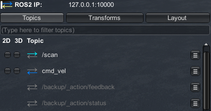

# Unity Robotics Visualizations Package

The Visualizations Package enables Unity projects to visualize incoming and outgoing information from ROS, such as sensor data, navigation messages, markers, and more. This package provides default configurations for common message types as well as APIs to create custom visualizations.

Get started with the Visualizations Package with our [Nav2-SLAM tutorial](https://github.com/Unity-Technologies/Robotics-Nav2-SLAM-Example)!

> This package is compatible with ROS 1 and ROS 2, and Unity versions 2020.2+.

**Table of Contents**
- [Installation](#installation)
- [Configuring a Visualization Suite](#configuring-a-visualization-suite)
    - [Priority Setter](#priority-setter)
- [The HUD](#the-hud)
- [Visualization Base Classes](#visualization-base-classes)
- [Using the Inspector](#using-the-inspector)
    - [Message Topics](#message-topics)
    - [TF Topics and Tracking](#tf-topics-and-tracking)
    - [Visualization Settings](#visualization-settings)
    - [Joy Messages](#joy-messages)
    - [Point Clouds](#point-clouds)

---

## Installation

1. Using Unity 2020.2 or later, open the Package Manager from `Window` -> `Package Manager`.
2. In the Package Manager window, find and click the + button in the upper lefthand corner of the window. Select `Add package from git URL....`

    

3. Enter `https://github.com/Unity-Technologies/ROS-TCP-Connector.git?path=/com.unity.robotics.visualizations` and click `Add`.

    > Note: you can append a version tag to the end of the git url, like `#v0.4.0` or `#v0.5.0`, to declare a specific package version, or exclude the tag to get the latest from the package's `main` branch.

4. The Visualizations package requires the corresponding version of the ROS TCP Connector package. If you haven't already installed it, click the + button again, enter `https://github.com/Unity-Technologies/ROS-TCP-Connector.git?path=/com.unity.robotics.ros-tcp-connector` and click `Add`.

## Configuring a Visualization Suite

This package contains a `DefaultVisualizationSuite` prefab, located in the [root of this package](../DefaultVisualizationSuite.prefab) that provides visualizer components for many common ROS message types, organized in the hierarchy by package. These components control how messages are displayed in the Unity scene. You may also create your own visualization suite by creating a GameObject with only the desired default or custom visualizer components for your project.

The package also contains an `EmptyVisualizationSuite` prefab (also located at the [root of this package](../EmptyVisualizationSuite.prefab)), which contains all necessary components to add visualizations, but none of the default visualizers so you may pick and choose which visualizers you want in the scene.

The UI windows for visualizations will automatically be laid out as they are turned on, but they can also be dragged and resized. The visualizations in the scene can be customized as described in the [Inspector](#using-the-inspector) section. The topics being visualized and the window configurations are saved between sessions and can be exported and loaded via the HUD's `Layout > Export/Import layout` buttons.

### Priority Setter

The [Priority Setter](../Runtime/Scripts/PrioritySetter.cs) allows users to modify which visualization is preferred, in case of multiple visualizers per ROS message type. All default visualizers default to priority `-1`, and custom visualizers will default to `0`, making custom visualizers a higher priority. This means that, when toggling on visualizations in the scene, the higher priority visualizers will be turned on.

To use the Priority Setter, simply add the PrioritySetter component to the GameObject that holds the visualization you want to modify, and set its `Priority` field value.

## The HUD

The top-left panel in the Game view provides a GUI system that offers tabs to toggle additional information about the state of the ROS communication and visualizations.

The default tabs on the HUD panel includes:

- **Topics**: Contains a list of all ROS topics on which this current session has sent or received a message. The `2D` toggle enables a window that shows the last message sent or received on that topic. The `3D` toggle enables an in-scene drawing that represents the last message sent or received on that topic. If no toggle is available, that topic does not have a default visualizer enabled in the Unity scene.
  - Topics that appear *white* are of a ROS message type that has a visualizer component in the scene, i.e. a `DefaultVisualizer` component or a custom visualizer script attached to a GameObject in the scene. This can include a 2D window, a 3D drawing, or both. In the example screenshot above, this is `/scan`, or `cmd_vel`.
  - Topics that appear *grey* are of a ROS message type that does *not* currently have a visualizer component in the scene. In the example screenshot above, this is `/backup/_action/feedback`, or `/backup/_action/status`.
  - The Topics tab also contains a search bar that allows you to search for topics.
- **Transforms**: Contains [`tf`](http://wiki.ros.org/tf) visualization options, including displaying the axes, links, and labels for each frame.
- **Layout**: Contains options to save and load this visualization configuration. While the visualization components are by default saved via the scene or the prefab, the window layout and visualized message list is saved as a JSON file. By default, this file is saved to a `RosHudLayout.json` file on your machine's [`Application.persistentDataPath`](https://docs.unity3d.com/ScriptReference/Application-persistentDataPath.html) and loaded on each session. In this Layout tab, you can choose to `Export` this JSON file with a custom name to a chosen location on your device, as well as `Import` a layout JSON file to begin using that saved visualization configuration.

The HUD is also designed to be customizable; you may add custom tabs or headers to the HUD. You can write a custom script similar to the [VisualizationLayoutTab](../Runtime/Scripts/VisualizationLayoutTab.cs) to extend the HUD.

> Get started with custom visualization scripts with the [Nav2: Making a Custom Visualizer](https://github.com/Unity-Technologies/Robotics-Nav2-SLAM-Example/blob/main/readmes/custom_viz.md) tutorial!

## Using the Inspector

The visualizers for each message type are implemented as Unity MonoBehaviours that are added as components to a GameObject in the scene. This is provided via the `DefaultVisualizationSuite` prefab, or in any custom visualization suite. In the `DefaultVisualizationSuite`, each individual default visualizer can be found by expanding the GameObject in the hierarchy and selecting the GameObject corresponding to the message type's package, e.g. `Geometry` for geometry_msgs.

### Message Topics

Visualizations, by default, are created based on ROS message types. However, you can also directly assign a topic in the visualizer component's Inspector--you can find the `<Type> Default Visualizer` component by expanding the `DefaultVisualizationSuite` GameObject in the Hierarchy and selecting the child object for the package. In the Inspector window, you will see all the default visualizers provided for this package (you may need to scroll down to see all added components).

The **Topic** field can be specifically assigned to customize visualizations for only that topic. This is particularly useful for adding multiple default visualizers of the same ROS message type, customized for different topics.

### TF Topics and Tracking

There are three options, found via the `TF Tracking Settings`, for how to visualize messages with stamped headers with respect to the TF tree.

**Tracking Type - Track Latest:** This setting reads the `frame_id` from the message header, queries the transform tree for the *latest* transform from that parent link, and draws the visualization with respect to that transform. With this setting, the drawing object will appear as a child GameObject of the GameObject corresponding to the proper `frame_id`. The drawing will have a zeroed local position and rotation, and the frame GameObject will be transformed based on the latest transform information.

**Tracing Type - Exact:** This setting reads the `frame_id` from the message header, queries the transform tree for the transform corresponding to the exact timestamp in the header, and draws the visualization with respect to that transform. With this setting, the the drawing object will appear as a child of the `BasicDrawingManager`. Its Transform will remain zero throughout the simulation, while its parent object’s Transform will show the value of the transform queried as described.

**Tracking Type - None:** This setting ignores the message header and draws messages with respect to the Unity's origin by setting the local position of the drawing to `Vector3.zero` and the local rotation to be `Quaternion.identity`. With this setting, the drawing object will appear in the `BasicDrawingManager`, and you’ll see that its Transform (Position and Rotation) remain zero throughout the simulation.

Additionally, it is important to track 3D visualizations in the proper coordinate frames.

**TF Topic:** By default, the `TF Topic` is assigned to `/tf`, but this can be replaced with a different or namespaced TF topic.

### Visualization Settings

The 3D visualizations offer customizations such as `label` and `color` fields, which will modify the drawing in the scene. Visualizations including lines or arrows (e.g. `sensor_msgs/Imu`) provide options for the length and thickness of the arrow as well as the radius around which any curved arrows are drawn. These customizations will be specific to each message type. Please note that changes to these settings will not be saved during runtime, and you will have to exit Play mode to save these modifications.

> Note: Size-related fields are in Unity coordinates, where 1 unit = 1 meter.

### Joy Messages

This package contains preconfigured button maps for the Xbox 360 wired and wireless controllers for Windows and Linux mappings, provided as ScriptableObjects in the [`Resources/VisualizerSettings`](../Runtime/DefaultVisualizers/Sensor/ScriptableObjects) directory.

You can create your own custom mapping for the Joy Default Visualizer by right-clicking in the Project window under `Create > Robotics > Sensor Visualizers > Joy`. Once the file is made, you can click into the asset and manually assign the button or axis index appropriate for your custom controller.

Once the mapping is done, in your Joy Default Visualizer component (e.g. `DefaultVisualizationSuite/Sensor/JoyDefaultVisualizer`), assign the `Settings` field to your newly made button map.

### Point Clouds

Similar to the Visualization Settings, point cloud visualizations are highly customizable. Settings for these visualizers (PointCloud, LaserScan, etc.) will be saved during runtime. For more information on this, you can check out the [base SettingsBasedVisualizer](../Editor/SettingsBasedVisualizerEditor.cs) class, as well as read more about Unity's [ScriptableObjects](https://docs.unity3d.com/Manual/class-ScriptableObject.html).

The standard settings are provided in ScriptableObjects. Default settings are provided in the `Resources/VisualizerSettings` directory, and can be created by right-clicking in the Project window under `Create > Robotics > Sensor Visualizers`. After being created, this configuration can be dragged and dropped into the component's Inspector field `Visualizer settings,` or selected by clicking on the small circle to the right of the field.

The settings available will depend on the ROS message type.

**Channel Name**: These settings allow you to choose which channel name corresponds to X, Y, Z, and color channels.

**Size**: Each point is by default a uniform size. This toggle allows you to select a channel that defines the size of each drawn point, e.g. using `intensity` to assign scale based on each point's intensity reading.

**Color**: The color options enable the point clouds to be drawn with configurable colors.

  - The `HSV` option allows you to choose a channel that will be automatically converted to colored points. This can be useful for visualizing individual lasers like a lidar's `ring` channel, for example.

  - The `Combined RGB` option is used for channels that should specifically be parsed into RGB data, e.g. `rgb` channels.

  - The `Separate RGB` is similar to the HSV option, but assigns a different channel to each R, G, and B color channel, which may be used for visualizing X, Y, and Z axes, for example.

**Range**: The min and max value fields configure the ranges for the sliding bar provided. This setting is applied to the respective range field.