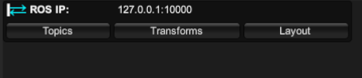
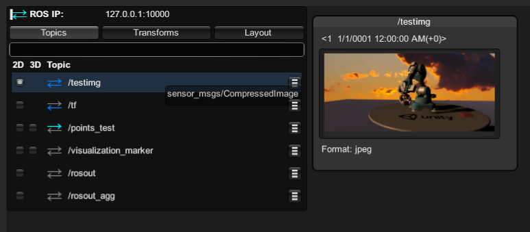
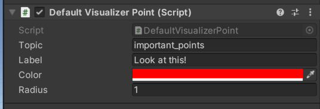

# Unity Robotics Visualizations Package

To install the Visualization Package in an existing Unity robotics project, open Window/Package Manager click the plus button and select "Add package from Git URL".
Paste in the following text, then click Install:
    "https://github.com/Unity-Technologies/ROS-TCP-Connector.git?path=/com.unity.robotics.visualizations"

Now, to get started with visualizations, navigate to Packages/com.unity.robotics.visualizations in your Project window, and drag the DefaultVisualizationSuite prefab into your Unity scene.
When you press play, in your ROSConnection HUD you should find three new tabs: Topics, Transforms and Layout.



(The HUD should appear in the top left corner of the Game window as long as you're in Play mode and a ROSConnection is active. If you don't see it, ensure "Show HUD" is ticked in your Robotics/ROS Settings window.)

When you click the Topics tab, it opens a list of all ROS topics published by any ROS node. You can see the actual ROS message type name by hovering over the topic. On the left you'll see "2D" and "3D" checkboxes to toggle visualizations for each topic. (For some messages, such as std_msgs/String for example, a 3d visualization doesn't make sense - you'll only see a 2D checkbox in those cases). Click on the appropriate checkbox to toggle that visualization for the given topic.



3D visualizations are simply drawn in your Unity scene, whereas 2D visualizations open in a window; You can move these windows around by dragging their title bar, or resize them by dragging the corners. The set of windows you have open, and their positions, are saved between sessions. (If necessary, you can export and import this layout file from the Layout tab.)

# Configuring your visualization suite

The DefaultVisualizationSuite prefab used above contains visualizations for most of the ROS common message types; if you expand the prefab in your hierarchy, you can see the individual components that provide the visualizations, and adjust their settings if you want.

For more fine grained control over your visualizations, you can add or remove your own visualizer components to the scene. The default visualizers should be easy to find: they're all named *MessageType*DefaultVisualizer - for example, `Vector3DefaultVisualizer`. Each visualizer can be set up to apply only to messages on a specific topic (just set the "topic" field - or leave it blank to apply to all messages of the appropriate type).

So, for example, let's assume you want to call out Point messages on the "important_points" topic, and you'd like them to appear extra large and in red. So maybe you'd add a DefaultVisualizerPoint script to your suite, and set it to draw large red points.



(Note that in Unity, "radius" is in Unity coordinates, so a radius of 1 means the points have a radius of 1 meter.)

On the right hand side of the Topics tab, you'll find a dropdown menu for selecting which visualizer to use for that topic.

# Writing a basic visualizer

Although there are many visualizers for common message types included the visualization package, no doubt at some point you'll have your own unique messages you want to visualize, or you'll want to customize how a message is displayed for your project's specific needs. The simplest way to create a new visualizer is to write a script that inherits from DrawingVisualizer<your message class>.

Here's a simple example. (You can find this code [in the ExampleVisualizers folder](Runtime/ExampleVisualizers/PointVisualizerExample.cs))

```csharp
using Unity.Robotics.MessageVisualizers;
using Unity.Robotics.ROSTCPConnector.ROSGeometry;
using UnityEngine;
using RosMessageTypes.Geometry;

public class PointVisualizerExample : DrawingVisualizer<PointMsg>
{
	// these settings will appear as configurable parameters in the Unity editor.
	public float m_Size = 0.1f;
	public Color m_Color;
	public string m_Label;

	public override void Draw(Drawing3d drawing, PointMsg msg, MessageMetadata meta)
	{
		// If the user hasn't specified a color, SelectColor helpfully picks one
		// based on the message topic.
		Color finalColor = MessageVisualizationUtils.SelectColor(m_Color, meta);

		// Similarly, if the user leaves the label blank, SelectLabel will use the
		// topic name as a label.
		string finalLabel = MessageVisualizationUtils.SelectLabel(m_Label, meta);

		// Most of the default visualizers offer static drawing functions
		// so that your own visualizers can easily send work to them.
		PointDefaultVisualizer.Draw<FLU>(msg, drawing, finalColor, m_Size);

		// You can also directly use the drawing functions provided by the Drawing class
		drawing.DrawLabel(finalLabel, msg.From<FLU>(), finalColor, m_Size);
	}

	public override System.Action CreateGUI(PointMsg msg, MessageMetadata meta)
	{
		// this code runs each time a new message is received.
		// If you want to preprocess the message or declare any state variables for
		// the GUI to use, you can do that here.
		string text = $"[{msg.x}, {msg.y}, {msg.z}]";

		return () =>
		{
			// this code runs once per UI event, like a normal Unity OnGUI function.
			GUILayout.Label(text);
		};
	}
}
```

- When the system is ready to display the graphics for a message, it will call your Draw() function, providing all the information you need about what drawing to create. The first parameter, `drawing`, is a convenient 3d drawing class that can display text, 3d lines, points, and other geometric shapes. This drawing will automatically be cleared before your Draw function is called, so all you have to do is call the drawing functions you want.
- When the HUD needs to display the GUI for your message, it will call CreateGUI on your class. CreateGUI should return a function that behaves like a normal Unity OnGUI callback: in other words, it will be invoked once per UI event, for as long as your visualizer is active, and any GUI elements you draw in this function will appear in the HUD. Note this is a runtime GUI, not an editor GUI; if you want your code to work in a build, the GUI functions you call should come from GUI or GUILayout, not EditorGUILayout.

# Writing a custom visualizer

If you want to create a visualization more complex than the simple DrawingVisualizer class can support, consider using its baseclass, the BaseVisualFactory.

The most obvious way that BaseVisualFactory is different from DrawingVisualizer is that it doesn't conceal the distinction between a Visualizer and a Visual.
- A Visualizer is a MonoBehaviour that's placed in your Unity scene. It has settings the user can adjust. It's responsible for creating Visuals.
- A Visual is an object created at runtime, associated with a specific topic. It subscribes to the given topic and displays the messages it receives.
- NB: When writing a visualizer, do not assume there's a one-to-one relationship between the visualizer and the message being displayed; a visualizer can create more than one visual at a time. In other words, do not store information or metadata about the message being visualized in the visualizer. That kind of information should be stored in the Visual.

Here's a simple example of a visualizer that instantiates a prefab to represent a Pose message. (You can also find this code [in the ExampleVisualizers folder](Runtime/ExampleVisualizers/PrefabVisualizerExample.cs))

```csharp
using UnityEngine;
using Unity.Robotics.ROSTCPConnector.ROSGeometry;
using Unity.Robotics.ROSTCPConnector.MessageGeneration;
using RosMessageTypes.Geometry;
using Unity.Robotics.MessageVisualizers;
using Unity.Robotics.ROSTCPConnector;

// A simple visualizer that places a (user configured) prefab to show the position and
// orientation of a Pose message
public class PrefabVisualizerExample : BaseVisualFactory<PoseMsg>
{
	// this setting will appear as a configurable parameter in the Unity editor.
	public GameObject prefab;

	// The BaseVisualFactory's job is just to create visuals for topics as appropriate.
	protected override IVisual CreateVisual(string topic)
	{
		return new PrefabVisual(topic, prefab);
	}

	// The job of the visual itself is to subscribe to a topic, and draw
	// representations of the messages it receives.
	class PrefabVisual : IVisual
    {
		GameObject m_Prefab;
		GameObject m_PrefabInstance;
		PoseMsg m_LastMessage;
		bool m_DrawingEnabled;

		public PrefabVisual(string topic, GameObject prefab)
		{
			m_Prefab = prefab;

			ROSConnection.GetOrCreateInstance().Subscribe<PoseMsg>(topic, AddMessage);
		}

		void AddMessage(PoseMsg message)
        {
		    // In this example we only store one message to visualize, but in principle
			// you could store all the messages in a list and do whatever you want with them.
			m_LastMessage = message;

			if (m_DrawingEnabled)
			{
				Redraw();
			}
		}

		public void SetDrawingEnabled(bool enabled)
		{
			m_DrawingEnabled = enabled;

			if (enabled)
			{
				Redraw();
			}
			else
			{
				GameObject.Destroy(m_PrefabInstance);
			}
		}

		public void Redraw()
        {
			GameObject.Destroy(m_PrefabInstance);

			if (m_LastMessage == null)
			{
				return;
			}

			m_PrefabInstance = GameObject.Instantiate(m_Prefab);
			m_PrefabInstance.transform.position = m_LastMessage.position.From<FLU>();
			m_PrefabInstance.transform.rotation = m_LastMessage.orientation.From<FLU>();
        }

        public void OnGUI()
        {
		    // This is just a normal Unity OnGUI function.
			// Draw the default GUI for a Pose message.
		    m_LastMessage.GUI();
        }
    }

	// true = this visualizer should have a "3d" drawing checkbox in the topics list
	public override bool CanShowDrawing => true;
}
```

- The CreateVisual function will only be called once for each topic, the first time visualizations are turned on for that topic.
- In order for your visual to actually receive messages, remember to call ROSConnection.GetOrCreateInstance().Subscribe<T> to subscribe to messages on the appropriate topic. Feel free to subscribe to more than one topic if necessary.
- If you still want to use the Drawing3d class to display your visualization, you can create one by calling Drawing3dManager.CreateDrawing(). For efficiency, you should not repeatedly create and destroy drawings; prefer to create a drawing once and call its Clear function when you need to update it.
